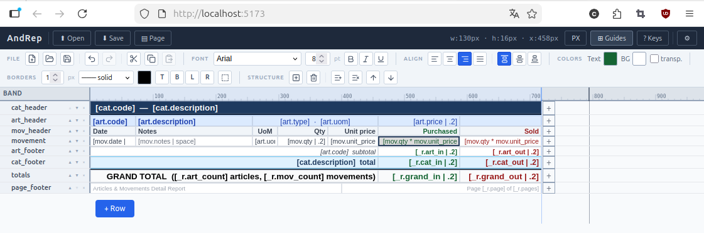
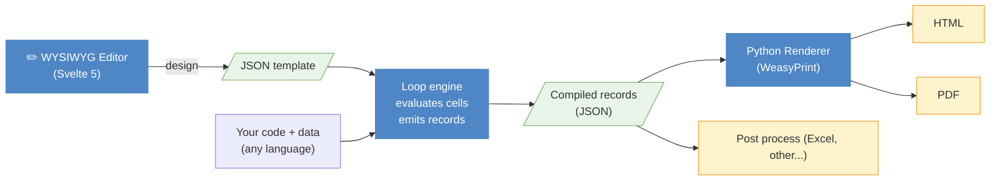
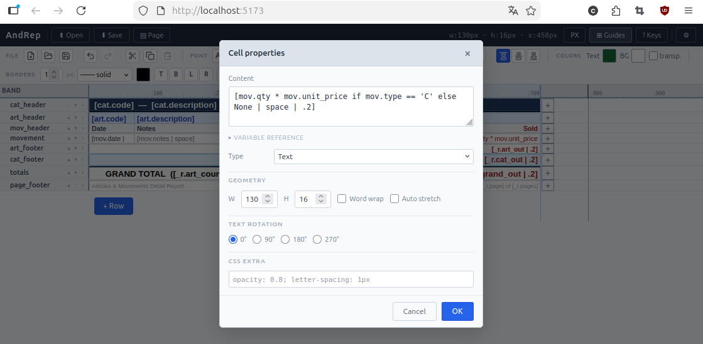
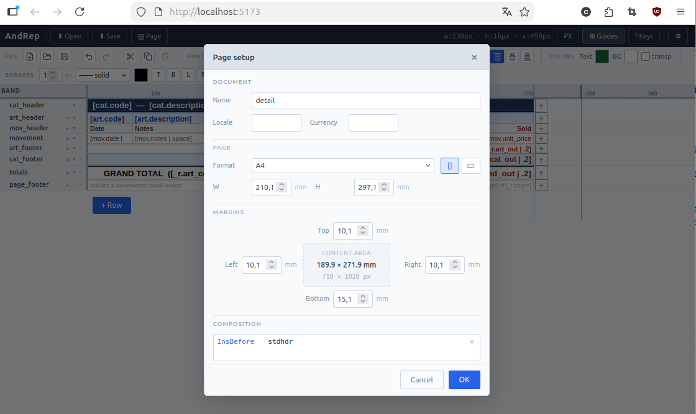
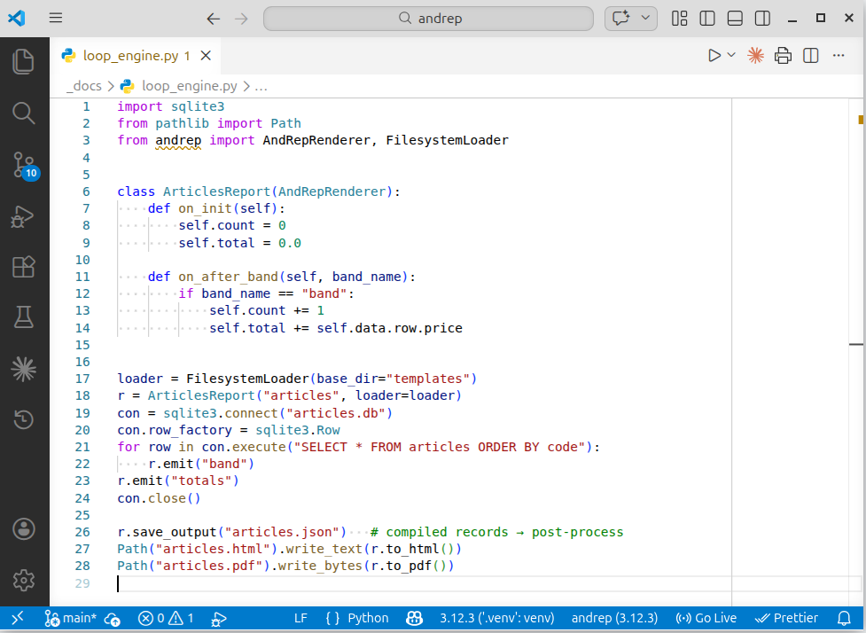
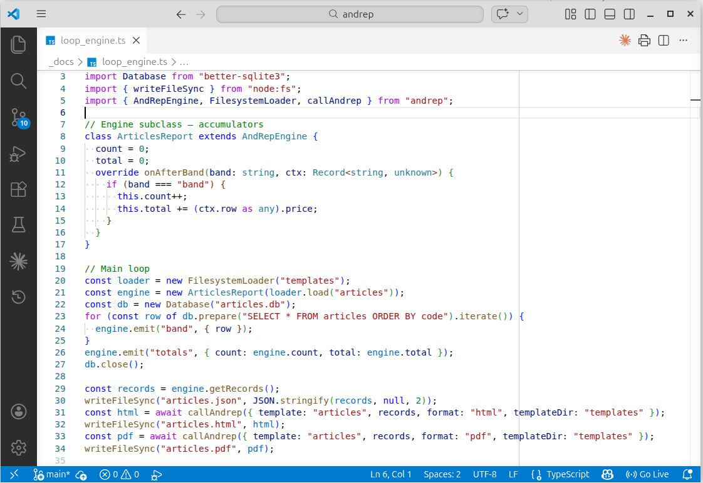

# AndRep

**Band-based report designer — WYSIWYG editor + language-agnostic HTML/PDF renderer.**



---

## What is AndRep?

AndRep is a reporting system built around two independent concerns:

1. **Template design** — a WYSIWYG editor lets you draw band-based layouts and save them as JSON
2. **Data binding + rendering** — your own code drives the print loop in whatever language you prefer; a Python renderer turns the result into HTML or PDF

Because the loop engine is plain code — no proprietary query language, no schema binding, no wizard — you have full control over data access, grouping, and business logic. Templates are pure JSON; the renderer knows nothing about your database.

---

## Architecture



---

## Key features

- **Language-agnostic** — write your report loop in Python, JavaScript, or any language; the renderer is a separate, stateless step
- **HTML-first** — output is standard HTML; PDF adds only automatic page breaks and band resizing via [WeasyPrint](https://weasyprint.org/)
- **WYSIWYG editor** — resize and style cells visually; configure bands, page format, margins, and composition rules
- **Template composability** — include and merge multiple templates to share headers, footers, and common sections across reports
- **Auto pagination** — special `page_role` bands (header, footer, filler) are placed automatically at every page break
- **Auto stretch** — cells and rows grow to fit their actual content (word wrap, images, Markdown)
- **Barcode / QR** — built-in SVG barcode and QR code cells, no raster images
- **JSON intermediate** — save compiled records as JSON and post-process them independently: generate Excel files, feed audit logs, diff two runs, or render the same data multiple times without re-running the loop
- **Zero framework dependency** — the Python renderer is a plain library; no web server required

---

## Screenshots

|           Editor canvas           |         Cell properties         |            Page setup            |
| :--------------------------------: | :------------------------------: | :------------------------------: |
|  |  |  |

Sample output: [detail report (PDF)](docs/data/03_detail.pdf) · [invoice (PDF)](docs/data/08_invoice.pdf)

---

## Quick start

### Editor

```bash
cd editor
pnpm install
pnpm dev          # http://localhost:5173
```

### Python renderer

```bash
pip install andrep[pdf]      # includes WeasyPrint for PDF output
```

```python
from andrep import AndRepRenderer, FilesystemLoader
from pathlib import Path

loader = FilesystemLoader(Path("templates/"))
r = AndRepRenderer("invoice", loader=loader)

for row in data:
    r.emit("band")       # local variables are captured automatically

html = r.to_html()
pdf  = r.to_pdf()
```

See [`renderer/examples/`](renderer/examples/) for full working examples: articles list, order detail, labels, barcodes, images/Markdown, and invoice.

## Loop engine examples

|                     Python                     |                       TypeScript                       |
| :--------------------------------------------: | :----------------------------------------------------: |
|  |  |

---

## How bands work

A template is a catalog of **bands** — named sections you emit in any order from your code:

```
first_header   ← printed on the first page only
page_header    ← printed on every subsequent page
──────────────────────────────────────────
band           ← your data rows (emit once per record)
subtotal       ← emit when a group changes
──────────────────────────────────────────
page_footer    ← every page except the last
last_footer    ← last page only
page_filler    ← fills blank space above the footer
```

The renderer imposes no structure and has no notion of groups or sorting — that logic lives in your code. The PDF engine handles page breaks, band placement, and filler automatically.

---

## Comparison

|                               | AndRep | Crystal Reports | JasperReports |  FastReport  |
| ----------------------------- | :----: | :-------------: | :-----------: | :----------: |
| Open source                   |   ✓   |       ✗       |      ✓      |      ✗      |
| Cross-platform                |   ✓   |  Windows only  |      ✓      | Windows only |
| Use your own language         |   ✓   |       ✗       |      ✗      |      ✗      |
| HTML-native output            |   ✓   |       ✗       |      ✗      |      ✗      |
| No proprietary expression DSL |   ✓   |       ✗       |      ✗      |      ✗      |
| Template composability        |   ✓   |     limited     |    limited    |   limited   |
| JSON intermediate output      |   ✓   |       ✗       |      ✗      |      ✗      |

---

## Components

| Component                   | Description                           | Status |
| --------------------------- | ------------------------------------- | :----: |
| [`editor/`](editor/)         | Svelte 5 WYSIWYG designer             | Usable |
| [`renderer/`](renderer/)     | Python renderer → HTML + PDF         | Usable |
| [`clients/js/`](clients/js/) | JS/TS loop engine (browser + Node.js) | Usable |
| `clients/python/`         | Python REST client                    | Usable |

---

## License

MIT — see [LICENSE](LICENSE)
