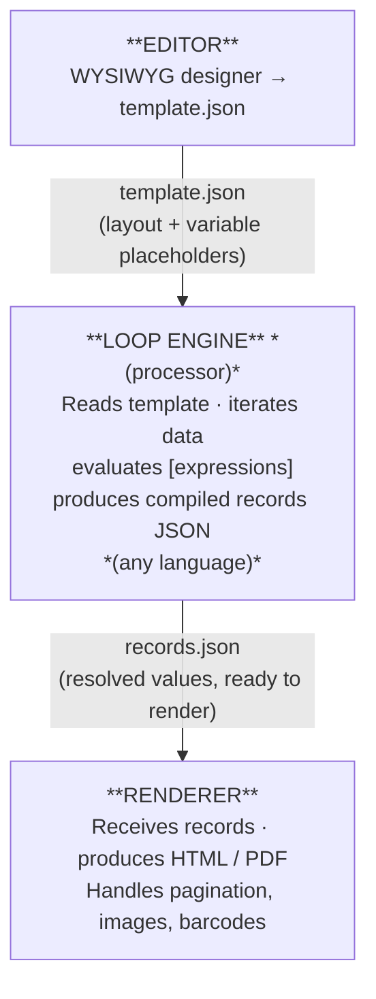

# AndRep — User Manual

## Contents

1. [Concepts](#1-concepts) — bands, rows, cells, page roles, emit loop
2. [Editor](#2-editor) — WYSIWYG designer guide
3. [Template format](#3-template-format) — JSON schema, PageConfig, all cell properties
4. [Variables &amp; formatters](#4-variables--formatters) — token syntax, all formatters, system variables
5. [Python renderer](#5-python-renderer) — emit loop, workspace, namespace, hooks, accumulators
6. [Cell types](#6-cell-types) — image, markdown, barcode, QR, embed
7. [Pagination](#7-pagination) — page roles, keepTogether, page_filler, manual breaks
8. [Template composition](#8-template-composition) — IfNot, Replace, InsBefore, InsAfter
9. [CLI &amp; multi-language](#9-cli--multi-language) — subprocess, JS client, REST server

---

## 1. Concepts

### Three-tier architecture

AndRep separates report generation into three independent layers:



This separation is the core principle of AndRep: **the renderer knows nothing about your
data; the loop engine knows nothing about HTML or PDF**. The contract between the two is a
plain JSON array — the *compiled records*.

| Integration scenario | Loop engine                              | Renderer                        |
| -------------------- | ---------------------------------------- | ------------------------------- |
| Python standalone    | `AndRepRenderer` (loop + render fused) | same                            |
| JS / Node.js         | TypeScript client (`clients/js/`)      | `python -m andrep render`     |
| PHP, Ruby, Go, …    | client in your language                  | `python -m andrep render`     |
| Any language + REST  | any client                               | built-in FastAPI / Flask server |

In the Python standalone mode, loop engine and renderer are merged into a single
`AndRepRenderer` class for convenience: `emit()` looks like a single call but internally
performs both roles. As soon as the loop runs in a different language, the two layers
appear as separate processes communicating through JSON.

---

### Band

A **band** is a named section of the report (e.g. `Header`, `Band`, `Totals`). The
template is a catalogue of available bands. The caller decides which bands to emit, in what
order, and how many times — the renderer imposes no structure.

```python
r.emit("Header")       # once
r.emit("Band")         # once per data row  (× N)
r.emit("Totals")       # once at the end
```

A band has a free-form name chosen by the designer. The only exception is the set of
[page-role bands](#page-role-bands) described below, whose names are reserved by the renderer.

---

### Row

Each band contains one or more **rows**. Rows stack vertically inside the band. The height
of a row is determined by its tallest cell.

All cells in a row share the same height — they are solidary. Two per-cell flags affect
how rows behave with variable-length content:

- **`wrap`** — the cell text wraps to the next line when it reaches the cell boundary.
- **`autoStretch`** — the cell grows vertically to fit its content. In PDF output the
  entire row resizes so all cells remain solidary; in HTML output only the individual cell
  expands. Useful for free-text fields, notes, or Markdown cells whose length is unknown at
  design time.

---

### Cell

A **cell** is the leaf unit of a layout. Every cell belongs to a row and has:

| Property        | Description                                                              |
| --------------- | ------------------------------------------------------------------------ |
| `width`       | Cell width (pixels)                                                      |
| `height`      | Cell height (pixels)                                                     |
| `content`     | Text string with interpolated variable tokens `[expr\|fmt]`             |
| `type`        | `text`, `markdown`, `image`, `barcode`, `qrcode`, or `embed` |
| `wrap`        | Enables text wrapping within the cell width                              |
| `autoStretch` | Enables vertical auto-sizing                                             |
| `rotation`    | `0` / `90` / `180` / `270` degrees                               |

Cells in a row are placed side by side with no gap between them.

Each cell also carries an independent **style**: font family, size, weight, color,
background color, horizontal and vertical alignment, padding (top/bottom/left/right), and
four independent border sides (each with its own width, style, and color).

---

### Variable tokens

Cell content is free text with embedded **tokens** in the form `[...]`. Text outside
tokens is rendered literally.

```
"Total: [total | .2] on [count] rows"
→  "Total: 1,234.56 on 42 rows"
```

**Token syntax:**

```
[expr]                 →  value with no formatting
[expr | fmt]           →  single formatter
[expr | fmt1 | fmt2]   →  chained formatters (applied left to right)
```

`expr` can be a variable name (`total`, `row.price`), an expression (`qty * price`), or an
array access (`items[0]`). The full formatter reference is in [Chapter 5](#5-formatters).

---

### Cell types

The cell `type` tells the renderer how to interpret the content and which HTML wrapper to
produce. Six types are available:

| Type         | Rendering behavior                                                           |
| ------------ | ---------------------------------------------------------------------------- |
| `text`     | Default. Free text with `[expr\|fmt]` tokens.                               |
| `markdown` | Content is parsed as Markdown and converted to HTML.                         |
| `image`    | Content is a URL, file path, or base64 data URI. Rendered as ``.      |
| `barcode`  | Value encoded as a 1-D barcode (EAN-13, Code128, …). Rendered as SVG.       |
| `qrcode`   | Value encoded as a QR code. Rendered as SVG.                                 |
| `embed`    | Name of another band rendered side-by-side inside the cell (one level deep). |

**Relationship between types and formatters.** Barcode and QR formatters (`ean13`,
`code128`, `qr`, …) can be used in **any** cell type, including `text`. When a formatter
produces an SVG string the renderer embeds it inline regardless of the cell type. The
`barcode` and `qrcode` types become relevant when no formatter is specified: in that case
the renderer generates the graphic directly from the cell value, using additional
cell-level properties (`barcodeType`, `showText`, `fontSize`). Similarly, the `image` type
controls the fallback behavior when the content is a plain URL with no `img` formatter.

See [Chapter 5](#5-formatters), [Chapter 7](#7-barcode-and-qr), and
[Chapter 8](#8-images-and-markdown) for detailed usage.

---

### Page-role bands

When producing PDF output, the renderer recognises five band names with reserved roles.
These bands are **never emitted by the caller** — the renderer inserts them automatically
at page breaks.

| Band name        | When rendered                                     |
| ---------------- | ------------------------------------------------- |
| `first_header` | Top of the**first page** only               |
| `page_header`  | Top of**every page** after the first        |
| `page_footer`  | Bottom of**every page** except the last     |
| `last_footer`  | Bottom of the**last page** only             |
| `page_filler`  | Fills the gap between the last row and the footer |

`page_filler` is useful for reports with a bordered grid: it replicates the column
structure of a data row with empty cells, "closing" the grid all the way down to the footer
regardless of how many data rows are on the page.

```
┌─────────────────────┐
│    page_header      │
├─────────────────────┤
│    data row 1       │
│    data row 2       │
│    page_filler      │  ← fills gap to footer
├─────────────────────┤
│    page_footer      │
└─────────────────────┘
```

A band with `keepTogether: true` is never split by a page break: if it does not fit on the
current page it moves entirely to the next one.

---

---

### System variables

These variables are injected automatically by the renderer into every cell:

| Variable    | Content                                        |
| ----------- | ---------------------------------------------- |
| `[_DATE]` | Print date (`dd/mm/yyyy`)                    |
| `[_TIME]` | Print time (`HH:MM:SS`)                      |
| `[_USER]` | User running the report (environment `USER`) |
| `[_PAGE]` | Current page number (PDF only)                 |

> **Note:** `[_PAGES]` (total page count) is not available in the base model. The renderer
> streams bands without a full pre-layout pass. For "Page X of Y" headers you need a
> two-pass strategy implemented in the caller.

---

## 2. Editor

### Why the editor exists

The editor produces a **template** — a JSON file that describes the visual layout of a
report. It does not process data and it does not generate output. Its only job is to let
you design, visually and precisely, what each band of the report will look like.

The connection to the actual output happens through the **emit loop** in your application
code. Every time your code calls `emit("Band")`, the renderer takes the band named `Band`
from the template and produces one rendered block, substituting the `[variable]`
placeholders with the real values from that iteration. Call `emit("Band")` a thousand times
and you get a thousand blocks — all with the same layout, each with different data.

This means the editor canvas is **not a page preview**. It is a catalogue of all the
bands you have defined. The order of bands in the canvas determines how rows stack *within*
a band (a band with multiple rows always emits them top to bottom), but the order of bands
in the final output is entirely controlled by the sequence of `emit()` calls in your code.

Two practical consequences worth keeping in mind:

- A band you never `emit()` is simply unused — it stays in the template but produces no output.
- The `[variable]` placeholders in the editor are literal text. There is no live preview
  of computed values; you reason about the layout, not the data.

> **Tip:** You can keep alternative row layouts in the same template under different names
> (e.g. `band` and `band_wide`). Only the one you actually `emit()` appears in the output.
> This is a practical way to compare two designs without discarding either.

---

### Starting the editor

The easiest way is the hosted version — no installation required:

**[https://claudiodriussi.github.io/andrep/](https://claudiodriussi.github.io/andrep/)**

Templates are saved as JSON files on your local machine; nothing is sent to any server.

To run the editor locally (needed only to modify the editor source):

```bash
cd editor
pnpm dev        # or: npm run dev
```

Open [http://localhost:5173](http://localhost:5173). The editor hot-reloads on every file save.

---

### The canvas

The canvas is the main work area. It is divided into three zones:

- **Horizontal ruler** — shows pixel positions across the full page width.
- **Band-name column** (left, frozen) — one label per row, showing the band name. This
  column also holds the row-level action buttons (move up/down, delete) and the inline
  rename handle.
- **Row area** — the cells, side by side, filling the page width.

All rows of all bands are stacked vertically in the canvas in the order they appear in
the template. Rows belonging to the same band sit adjacent to each other; their band name
appears in the left column.

Toggle **design guides** from the toolbar to show dashed outlines around cells, which
makes it easier to see cell boundaries when cells have no border.

---

### Header bar

The header bar runs across the top of the editor (dark background). It contains:

| Control                         | Description                                                                                                                                                              |
| ------------------------------- | ------------------------------------------------------------------------------------------------------------------------------------------------------------------------ |
| **Open** / **Save** | Load or write the template JSON file (`Ctrl+O` / `Ctrl+S`)                                                                                                           |
| **Page**                  | Open the*Page setup* dialog (format, margins, locale, currency)                                                                                                        |
| *Cell info*                   | When a cell is selected, shows its width, height, and x position in the current unit. With multiple cells selected, shows the count and the overall bounding dimensions. |
| **px / mm / in**          | Click to cycle the display unit used in the ruler, cell info, and dialogs                                                                                                |
| **Guides**                | Toggle dashed design guides around cells                                                                                                                                 |
| **? Keys**                | Open the keyboard shortcuts cheat sheet                                                                                                                                  |
| **⚙**                    | Open the configuration menu:*Preferences*, *Load config*, *Save config*, *Reset to defaults*                                                                     |

---

### Toolbar

The toolbar sits below the header bar and is organized into seven configurable groups.
Their order and visibility can be changed in *Preferences*.

| Group               | Contents                                                            |
| ------------------- | ------------------------------------------------------------------- |
| **File**      | New, Open, Save, Undo, Redo, Cut, Copy, Paste                       |
| **Font**      | Font family, size, Bold, Italic, Underline                          |
| **Align H**   | Left, Center, Right, Justify                                        |
| **Align V**   | Top, Middle, Bottom                                                 |
| **Colors**    | Text color, Background color (palette + color picker + transparent) |
| **Borders**   | Pen width, pen style, pen color; per-side toggles; remove all       |
| **Structure** | Add row, Delete row, Add cell, Delete cell, Move row up/down        |

Toolbar controls reflect the state of the **current selection**. When multiple cells are
selected, controls show the value shared by all selected cells (or blank if they differ),
and changes apply to all of them at once.

---

### Bands and rows

A **band** in the editor is a group of one or more rows that share the same name. You
manage bands and rows with the following operations:

| Action                 | How                                                                            |
| ---------------------- | ------------------------------------------------------------------------------ |
| Add a row              | `Alt+Insert` — prompts for band name; the row is added after the active row |
| Delete a row           | `Alt+Delete` or the × button in the band-name column                        |
| Move a row up / down   | `Alt+↑` / `Alt+↓` or the ▲ ▼ buttons                                   |
| Resize row height      | `Ctrl+↑` / `Ctrl+↓` (all cells in the row resize together)               |
| Rename a band          | Double-click the band name label in the left column                            |
| Copy / cut / paste row | `Ctrl+Shift+C` / `Ctrl+Shift+X` / `Ctrl+Shift+V`                         |

Band membership is determined by name, not by position: all rows that share the same name
belong to the same band and are rendered top to bottom when that band is emitted. Rows of
the same band do not need to be contiguous in the canvas — but keeping them together
improves readability. The relative order of different bands in the canvas has no effect on
the output; the caller controls that order through the sequence of `emit()` calls.

---

### Cells

#### Selecting

Click a cell to select it (it becomes the **active cell**). Hold `Shift` and click, or use
`Shift+←` / `Shift+→` / `Shift+↑` / `Shift+↓`, to extend the selection to adjacent
cells. `Ctrl+A` selects all cells in the template. `Escape` clears the selection.

#### Adding and deleting

| Action                | How                                                             |
| --------------------- | --------------------------------------------------------------- |
| Add cell              | `Insert` — adds a cell after the active cell in the same row |
| Delete selected cells | `Delete`                                                      |

#### Moving and resizing

| Action                 | How                                    |
| ---------------------- | -------------------------------------- |
| Move cell left / right | `Alt+←` / `Alt+→`                |
| Narrow / widen cell    | `Ctrl+←` / `Ctrl+→` (step: 4 px) |
| Resize by dragging     | Drag the right edge handle of the cell |

#### Editing content

| Action                 | How                                                         |
| ---------------------- | ----------------------------------------------------------- |
| Open inline editor     | `Enter`, or type any printable character (pre-inserts it) |
| Open properties dialog | `Alt+Enter` or double-click the cell                      |

The **inline editor** opens directly on the canvas at the exact cell dimensions. It is
suited for quick content edits. Press `Enter` or click outside to confirm, `Escape` to
cancel.

#### Clipboard

| Action      | Shortcut   |
| ----------- | ---------- |
| Copy cells  | `Ctrl+C` |
| Cut cells   | `Ctrl+X` |
| Paste cells | `Ctrl+V` |

The clipboard holds the copied cells in memory. Pasting inserts them after the active cell
in the active row. The clipboard is cleared when you close the browser tab.

---

### Cell properties dialog

Open with `Alt+Enter` or by double-clicking a cell. This dialog gives access to all cell
properties in one place.

**Content & type**

- **Type** — `text`, `markdown`, `image`, `barcode`, `qrcode`, `embed`. See [Chapter 6](#6-cell-types).
- **Content** — the text with `[variable|formatter]` placeholders.
- A variable reference panel lists the `[token]` expressions found in the content field,
  with links to the formatter documentation. Formatters must be typed manually.

**Geometry & behavior**

- **Width** and **Height** — in pixels.
- **Wrap** — enables text wrapping.
- **Auto stretch** — enables vertical auto-sizing.
- **Rotation** — 0 / 90 / 180 / 270 degrees.

**Font & colors**

- Font family, size, Bold, Italic, Underline.
- Text color, background color.

**Alignment**

- Horizontal: Left / Center / Right / Justify.
- Vertical: Top / Middle / Bottom.

**Borders**

- Each side (top, right, bottom, left) is independent: width, style (`solid`, `dashed`,
  `dotted`, `double`), color.

**Padding**

- Top, right, bottom, left (pixels).

**CSS extra**

- Arbitrary inline CSS applied to the cell `<div>`. Can contain `[variable]` expressions
  prefixed with `@` for dynamic styles (e.g. `@color:[row.status_color]`).

---

### Page setup

Open from the toolbar popup menu or the *Page* button. Configures the page for the
current template.

| Setting                  | Description                                             |
| ------------------------ | ------------------------------------------------------- |
| **Preset**         | A5, A4, A3, Letter, Legal, or custom                    |
| **Orientation**    | Portrait / Landscape (swaps width and height)           |
| **Width / Height** | In pixels (A4 portrait: 794 × 1123 px at 96 dpi)       |
| **Margins**        | Top, bottom, left, right (pixels)                       |
| **Locale**         | Used by date and number formatters (e.g.`it`, `en`) |
| **Currency**       | Symbol used by the `currency` formatter               |

The dialog also contains a **Composition** section where you can add and remove merge rules
that bring in bands from other template files at load time. See [Chapter 8](#8-template-composition)
for a full explanation.

Page settings are saved inside the template JSON and travel with it.

---

### Preferences

Open from the **⚙** menu in the header bar. Configures the editor itself (not individual
templates). Settings are saved in the browser's local storage.

**General**

| Setting                  | Description                                                                                                                                          |
| ------------------------ | ---------------------------------------------------------------------------------------------------------------------------------------------------- |
| **UI language**    | `en` or `it`. Additional languages can be added on request — each language requires only a single translation file in `editor/src/lib/i18n/`. |
| **Units**          | Display unit used in ruler, cell info, and dialogs:`px`, `mm`, or `inch`                                                                       |
| **Draft autosave** | `Single` — one shared slot, survives tab close; `Per tab` — separate slot per browser tab, lost when the tab is closed                         |

**New template defaults** — applied when creating a new template with `Ctrl+N`

| Setting                    | Description                                                    |
| -------------------------- | -------------------------------------------------------------- |
| **Paper size**       | A6, A5, A4, A3, Letter, Legal, or custom                       |
| **Margins**          | Top, bottom, left, right (pixels)                              |
| **Default locale**   | e.g.`it-IT`, `en-US` — used by date and number formatters |
| **Default currency** | e.g.`EUR`, `USD` — used by the `currency` formatter     |

**Font**

| Setting                       | Description                                       |
| ----------------------------- | ------------------------------------------------- |
| **Default font / size** | Applied to every new cell                         |
| **Font families**       | Editable list of fonts shown in the font selector |

**Colors** — editable lists of color swatches shown in the color picker

- **Foreground palette** — text and border colors
- **Background palette** — cell background colors

**Toolbar groups** — checkboxes to show/hide each group; ↑ ↓ buttons to reorder them.

**Band name presets** — editable list of name suggestions offered when adding a new row
(`Alt+Insert`).

Preferences can be exported to a JSON file (*Save config* in the ⚙ menu) and imported in
another browser or shared with a team (*Load config*).

---

### Undo and redo

Every operation that modifies the template pushes a full JSON snapshot onto the undo stack.
Up to 100 steps are kept per session.

| Action | Shortcut                       |
| ------ | ------------------------------ |
| Undo   | `Ctrl+Z`                     |
| Redo   | `Ctrl+Shift+Z` or `Ctrl+Y` |

---

### Draft autosave

The editor automatically saves a draft of the current template to the browser's local
storage while you work. If you close the tab accidentally, the draft is restored on the
next open.

Two draft modes (configurable in *Preferences*):

- **Single** — one shared draft slot, overwritten on every change.
- **Session** — a separate draft slot per browser session.

The draft is distinct from an explicitly saved file. Use `Ctrl+S` to write the template to
a file on disk.

---

### Keyboard shortcuts

The complete list of keyboard shortcuts is available at any time inside the editor: press
**`?`** or click **? Keys** in the header bar to open the cheat sheet overlay.

---

## 3. Template format

A template is a UTF-8 JSON file. The editor reads and writes this format directly; you
can also edit it by hand or generate it programmatically.

### Top-level structure

```json
{
  "_type":      "andrep-template",
  "name":       "MyReport",
  "version":    "1.0",
  "page":       { … },
  "rows":       [ … ],
  "bands":      { … },
  "composition": [ … ]
}
```

| Field           | Type                          | Description                                                  |
| --------------- | ----------------------------- | ------------------------------------------------------------ |
| `_type`       | `"andrep-template"`         | File signature — validated on load                          |
| `name`        | string                        | Template name (shown in the editor title)                    |
| `version`     | string                        | Free-form version string                                     |
| `page`        | PageConfig                    | Page dimensions, margins, locale, currency                   |
| `rows`        | Row[]                         | All rows of all bands, in order                              |
| `bands`       | Record\<string, BandOptions\> | Optional per-band settings, keyed by band name               |
| `composition` | CompositionRule[]             | Optional merge rules — see [Chapter 8](#8-template-composition) |
| `expressions` | Record\<string, Record\<string, string\>\> | Optional per-language expression translations — see [Chapter 9](#9-cli--multi-language) |

---

### PageConfig

| Field            | Type                                                      | Default      | Description                                                        |
| ---------------- | --------------------------------------------------------- | ------------ | ------------------------------------------------------------------ |
| `preset`       | `A5`\|`A4`\|`A3`\|`Letter`\|`Legal`\|`custom` | `A4`       | Page size preset                                                   |
| `width`        | integer px                                                | 794          | Page width (A4 portrait at 96 dpi)                                 |
| `height`       | integer px                                                | 1123         | Page height                                                        |
| `marginTop`    | integer px                                                | 38           | Top margin                                                         |
| `marginBottom` | integer px                                                | 57           | Bottom margin                                                      |
| `marginLeft`   | integer px                                                | 38           | Left margin                                                        |
| `marginRight`  | integer px                                                | 38           | Right margin                                                       |
| `orientation`  | `portrait`\|`landscape`                               | `portrait` | Swapping orientation swaps width and height                        |
| `locale`       | string                                                    | `""`       | BCP 47 locale for date/number formatters (e.g.`it-IT`)           |
| `currency`     | string                                                    | `""`       | Currency symbol/code for the `currency` formatter (e.g. `EUR`) |
| `columns`      | integer                                                   | 1            | Number of page columns (label / multi-column layouts)              |
| `columnGap`    | integer px                                                | 0            | Horizontal gap between page columns                                |

---

### Row

| Field     | Type   | Description                                                     |
| --------- | ------ | --------------------------------------------------------------- |
| `id`    | string | Unique identifier (auto-generated by the editor)                |
| `name`  | string | Band name — rows sharing the same name belong to the same band |
| `cells` | Cell[] | Ordered list of cells in this row                               |

---

### Cell

| Field           | Type                            | Default   | Description                                                                                                              |
| --------------- | ------------------------------- | --------- | ------------------------------------------------------------------------------------------------------------------------ |
| `id`          | string                          | —        | Unique identifier                                                                                                        |
| `content`     | string                          | `""`    | Text with `[expr\|fmt]` tokens. For `embed` cells, unused (see `embedTarget`)                                       |
| `type`        | CellType                        | `text`  | `text`, `markdown`, `image`, `barcode`, `qrcode`, `embed`                                                    |
| `embedTarget` | string                          | —        | Band name to render inside the cell (only when `type === "embed"`)                                                     |
| `x`           | integer px                      | 0         | Horizontal offset from the row left edge. Not currently managed by the editor — cells are placed adjacent to each other |
| `width`       | integer px                      | 100       | Cell width                                                                                                               |
| `height`      | integer px                      | 24        | Cell height                                                                                                              |
| `wrap`        | boolean                         | `false` | Enable text wrapping                                                                                                     |
| `autoStretch` | boolean                         | `false` | Expand cell height to fit content                                                                                        |
| `rotation`    | `0`\|`90`\|`180`\|`270` | `0`     | Text rotation in degrees                                                                                                 |
| `cssExtra`    | string                          | —        | Additional inline CSS appended to the cell `<div>`. May contain `@expr` for dynamic values                           |
| `style`       | CellStyle                       | —        | Visual style (see below)                                                                                                 |

---

### CellStyle

| Field                 | Type        | Values                                             |
| --------------------- | ----------- | -------------------------------------------------- |
| `fontFamily`        | string      | Any CSS font family (e.g.`"Arial"`)              |
| `fontSize`          | number      | Point size                                         |
| `fontWeight`        | string      | `normal` \| `bold`                             |
| `fontStyle`         | string      | `normal` \| `italic`                           |
| `textDecoration`    | string      | `none` \| `underline` \| `line-through`      |
| `color`             | string      | CSS color (e.g.`"#1e293b"`)                      |
| `backgroundColor`   | string      | CSS color or `""` for transparent                |
| `alignment`         | string      | `left` \| `center` \| `right` \| `justify` |
| `verticalAlignment` | string      | `top` \| `middle` \| `bottom`                |
| `paddingTop`        | number px   |                                                    |
| `paddingBottom`     | number px   |                                                    |
| `paddingLeft`       | number px   |                                                    |
| `paddingRight`      | number px   |                                                    |
| `borders`           | CellBorders | Per-side border definitions                        |

**CellBorders** — each of `top`, `right`, `bottom`, `left` is a `BorderSide`:

| Field     | Type      | Values                                                          |
| --------- | --------- | --------------------------------------------------------------- |
| `width` | number px |                                                                 |
| `style` | string    | `none` \| `solid` \| `dashed` \| `dotted` \| `double` |
| `color` | string    | CSS color                                                       |

---

### BandOptions

Optional per-band settings stored in the top-level `bands` object, keyed by band name:

```json
"bands": {
  "Band": { "keepTogether": true },
  "Labels": { "columns": 3, "columnGap": 8 }
}
```

| Field            | Type       | Default   | Description                                     |
| ---------------- | ---------- | --------- | ----------------------------------------------- |
| `keepTogether` | boolean    | `false` | Prevent page breaks inside this band (PDF only) |
| `columns`      | integer    | 1         | Render this band in multiple columns            |
| `columnGap`    | integer px | 0         | Gap between columns                             |

---

### Page-role bands

Five band names are reserved by the renderer and trigger automatic pagination behavior
in PDF output. See [Chapter 7 — Pagination](#7-pagination) for the full reference.

---

### CompositionRule

The `composition` array lists merge rules that bring in rows from external template files
at load time. Rules are applied in order.

```json
"composition": [
  { "rule": "InsBefore", "target": "standard_header" },
  { "rule": "IfNot",     "target": "standard_footer" }
]
```

| Field      | Type   | Description                                                          |
| ---------- | ------ | -------------------------------------------------------------------- |
| `rule`   | string | `IfNot` \| `Replace` \| `InsBefore` \| `InsAfter`            |
| `target` | string | Name of the external template to merge (without `.json` extension) |

See [Chapter 8 — Template composition](#8-template-composition) for the behavior of each
rule type.

---

### Minimal example

```json
{
  "_type": "andrep-template",
  "name": "Articles",
  "version": "1.0",
  "page": {
    "preset": "A4",
    "width": 794, "height": 1123,
    "marginTop": 38, "marginBottom": 57,
    "marginLeft": 38, "marginRight": 38,
    "orientation": "portrait",
    "locale": "it-IT", "currency": "EUR"
  },
  "rows": [
    {
      "id": "r1", "name": "page_header",
      "cells": [
        {
          "id": "c1", "type": "text",
          "content": "Code", "x": 0, "width": 120, "height": 24,
          "wrap": false, "autoStretch": false,
          "style": { "fontFamily": "Arial", "fontSize": 9, "fontWeight": "bold",
                     "fontStyle": "normal", "textDecoration": "none",
                     "color": "#000000", "backgroundColor": "",
                     "alignment": "left", "verticalAlignment": "top",
                     "paddingTop": 2, "paddingBottom": 2,
                     "paddingLeft": 4, "paddingRight": 4,
                     "borders": {
                       "top":    { "width": 1, "style": "solid", "color": "#000000" },
                       "bottom": { "width": 1, "style": "solid", "color": "#000000" },
                       "left":   { "width": 0, "style": "none",  "color": "#000000" },
                       "right":  { "width": 0, "style": "none",  "color": "#000000" }
                     } }
        }
      ]
    },
    {
      "id": "r2", "name": "band",
      "cells": [
        {
          "id": "c2", "type": "text",
          "content": "[row.code]", "x": 0, "width": 120, "height": 20,
          "wrap": false, "autoStretch": false,
          "style": { "fontFamily": "Arial", "fontSize": 9, "fontWeight": "normal",
                     "fontStyle": "normal", "textDecoration": "none",
                     "color": "#000000", "backgroundColor": "",
                     "alignment": "left", "verticalAlignment": "top",
                     "paddingTop": 2, "paddingBottom": 2,
                     "paddingLeft": 4, "paddingRight": 4,
                     "borders": {
                       "top":    { "width": 0, "style": "none", "color": "#000000" },
                       "bottom": { "width": 1, "style": "solid", "color": "#cccccc" },
                       "left":   { "width": 0, "style": "none", "color": "#000000" },
                       "right":  { "width": 0, "style": "none", "color": "#000000" }
                     } }
        }
      ]
    }
  ],
  "bands": {},
  "composition": []
}
```

In practice, templates are always created and edited through the editor — hand-editing the
JSON is useful mainly for scripted generation or bulk changes across many files.

---

## 4. Variables & formatters

### Token syntax

Cell content is free text with embedded **tokens** delimited by `[` and `]`. Text outside
tokens is rendered literally.

```
"Invoice [_DATE]  —  page [_PAGE]"
→  "Invoice 28/03/2026  —  page 1"
```

A token has the form:

```
[expr]                   plain value, no formatting
[expr | fmt]             single formatter
[expr | fmt1 | fmt2]     chained formatters, applied left to right
```

Nested brackets are handled correctly, so array indexing works as expected:

```
[items[0].name]
[matrix[row_idx][col_idx] | .2]
```

The `|` character inside an expression is interpreted as the Python logical-OR operator
(`||` is also valid Python). To use a literal `|` as the formatter separator when the
expression itself contains `|`, escape it as `\|`:

```
[a | b \| upper]   →  (a | b) formatted with "upper"
```

---

### Expressions

The `expr` part is evaluated as a Python expression inside a restricted namespace. You can
use:

| Form                               | Example                                  |
| ---------------------------------- | ---------------------------------------- |
| Variable name                      | `total`                                |
| Dotted attribute accessno, fallo a | `row.price`, `customer.address.city` |
| Array / index access               | `items[0]`, `row.tags[2]`            |
| Arithmetic                         | `qty * price`, `total / count`       |
| String operations                  | `row.code + " - " + row.desc`          |
| Conditional                        | `discount if qty > 10 else 0`          |
| Logical OR for fallback            | `row.nickname \|\| row.name`             |

The namespace is built from the caller's local variables, the explicit workspace, and
registered globals. See [Chapter 5](#5-python-renderer) for the full namespace priority.

> **Expression evaluation is loop-engine-specific.** The syntax above describes the
> **Python loop engine**, where `expr` is evaluated with Python's `eval()` inside a
> restricted namespace. Python operators, attribute access, and conditional expressions
> (`x if cond else y`) work exactly as in Python code.
>
> The **JS loop engine** (`clients/js/`) evaluates the same `[expr|fmt]` tokens in
> JavaScript: `||` is still logical OR and dotted access works the same, but
> Python-specific constructs like `x if cond else y` are not valid — use
> `cond ? x : y` instead.
>
> A **custom loop engine** in any language can evaluate expressions however it chooses.
> The `[expr|fmt]` syntax is a template contract, not a mandate for any specific
> evaluation strategy.
>
> When a template written with Python expressions needs to be used from a non-Python
> engine, the `andrep-expr` CLI tool can extract all expressions into a translation file,
> let you provide the equivalent in the target language, and merge them back into the
> template under `expressions[lang]`. The loop engine then picks the right translation at
> runtime. See [Chapter 9](#9-cli--multi-language) for the full workflow.

---

### String formatters

| Formatter | Effect                                               | Example                                   |
| --------- | ---------------------------------------------------- | ----------------------------------------- |
| `upper` | Convert to UPPERCASE                                 | `[name\|upper]` → `"MARIO ROSSI"`     |
| `lower` | Convert to lowercase                                 | `[name\|lower]` → `"mario rossi"`     |
| `trim`  | Strip leading and trailing whitespace                |                                           |
| `space` | Return `""` if value is `None`, `""`, or `0` | `[qty\|space]` → `""` if qty is 0     |
| `zeros` | Return `"0"` if value is `None` or `""`        | `[qty\|zeros]` → `"0"` if qty is None |

`space` and `zeros` are opposites: `space` hides zero/null values; `zeros` makes them
explicit.

---

### Numeric formatters

Numbers are formatted with **Italian separators** by default: `.` as thousands separator
and `,` as decimal separator.

| Formatter    | Effect                                                   | Example                               |
| ------------ | -------------------------------------------------------- | ------------------------------------- |
| `N`        | N decimal places, no thousands separator                 | `[v\|2]` → `"1234.50"`            |
| `.N`       | Thousands separator + N decimals                         | `[v\|.2]` → `"1.234,50"`          |
| `W.N`      | Right-justify in W characters, thousands + N decimals    | `[v\|10.2]` → `"  1.234,50"`      |
| `+.N`      | Like `.N` with explicit `+` sign for positive values | `[v\|+.2]` → `"+1.234,50"`        |
| `currency` | Thousands + 2 decimals with `€` symbol                | `[v\|currency]` → `"€ 1.234,50"` |

Formatters can be chained to combine effects:

```
[amount | .2 | space]    →  formatted with thousands/decimals, blank if zero
[balance | +.2]          →  "+1.234,50" or "-567,00"
```

---

### Date formatters

| Formatter      | Effect                                                                 |
| -------------- | ---------------------------------------------------------------------- |
| `date`       | Format a `date` / `datetime` value as `dd/mm/yyyy`               |
| `dd/mm/yyyy` | Explicit format using `d`, `m`, `y` tokens (e.g. `yyyy-mm-dd`) |

The explicit format pattern replaces: `dd` → day, `mm` → month, `yyyy` → 4-digit year,
`yy` → 2-digit year.

```
[row.delivery_date | date]          →  "28/03/2026"
[row.delivery_date | yyyy-mm-dd]    →  "2026-03-28"
```

If the value is not a `date` / `datetime` object it is converted to string unchanged.

---

### Image formatter — `img`

Converts a path, URL, or base64 data URI into an HTML `` element. Local file paths
(including `@relative/path` references) are resolved to base64 data URIs automatically, so
the image is embedded in the HTML and works in PDF output too.

```
[row.photo | img]              proportional, width 100%, height adapts
[row.photo | img,contain]      object-fit: contain (full image visible)
[row.photo | img,cover]        object-fit: cover (fills cell, clips excess)
[row.photo | img,natural]      natural size, no upscaling
[row.photo | img,cover,silent] cover mode, no error if image is missing
```

`silent` suppresses the `[#ref#]` error marker for missing files.

---

### File loader — `load`

Loads the content of a local file or a URL and returns it as a string. Useful for cells
that embed external text or Markdown content.

```
["@data/notes.txt" | load]            load text file relative to base_dir
["@data/logo.png"  | load,base64]     embed as data:image/png;base64,...
["@data/doc.txt"   | load,silent]     return "" if file is missing
```

`@ref` notation:

- `@relative/path` — resolved relative to `r.base_dir` (set at renderer construction)
- `@/absolute/path` — absolute filesystem path
- `@https://...` — HTTP fetch

---

### Barcode and QR formatters

These formatters return an SVG string. The renderer embeds it inline regardless of the
cell type (they work in `text` cells too, not only in `barcode` / `qrcode` cells).

**QR code:**

```
[row.url | qr]           QR code, cell dimensions
[row.url | qr,150]       QR code 150×150 px
```

**1-D barcodes:**

```
[row.ean | ean13]                      EAN-13, cell dimensions
[row.ean | ean13,200,52]               200×52 px
[row.ean | ean13,200,52,0]             no human-readable text below bars
[row.code | code128,200,40]            Code-128, 200×40 px
```

Full syntax: `name[,width[,height[,show_text[,font_size]]]]`

Supported 1-D barcode types: `codabar`, `code128`, `code39`, `ean`, `ean13`, `ean14`,
`ean8`, `gs1`, `gs1_128`, `gtin`, `isbn`, `isbn10`, `isbn13`, `issn`, `itf`, `jan`,
`nw-7`, `pzn`, `upc`, `upca`.

---

### System variables

Injected automatically into every cell by the renderer:

| Variable    | Content                                                        |
| ----------- | -------------------------------------------------------------- |
| `[_DATE]` | Print date (`dd/mm/yyyy`)                                    |
| `[_TIME]` | Print time (`HH:MM:SS`)                                      |
| `[_USER]` | User running the report (OS environment `USER`)              |
| `[_PAGE]` | Current page number (PDF only; 1-based)                        |
| `[_r]`    | The renderer instance — access accumulators:`[_r.total\|.2]` |
| `[_name]` | Name of the band currently being rendered                      |

> **Note:** `[_PAGES]` (total page count) is not available. The renderer streams bands
> without a full pre-layout pass. For "Page X of Y" use a two-pass strategy in the caller.

---

### Error handling

| Situation                               | Result                              |
| --------------------------------------- | ----------------------------------- |
| Division by zero                        | `0`                               |
| Any other evaluation error              | `[#expr#]` (visible debug marker) |
| Missing image / file with `silent`    | `""` (empty string)               |
| Missing image / file without `silent` | `[#ref#]` (visible debug marker)  |

---

### Custom formatters

Per-renderer custom formatters can be registered on the renderer instance without
modifying the built-in code. They are checked before all built-ins.

```python
# Python renderer
r.formatters["indent"] = lambda value, fmt, r: "\u00a0" * 4 * int(value or 0)
r.formatters["stars"]  = lambda value, fmt, r: "★" * int(value or 0)
```

The signature is `(value, fmt, r) -> any` where `fmt` is the full formatter string
(including any comma-separated parameters) and `r` is the renderer instance.

In the JS loop engine, custom formatters are registered on the engine instance before
producing compiled records. See [Chapter 9](#9-cli--multi-language).

---

## 5. Python renderer

### Installation

For a full walkthrough — system prerequisites, virtual environment setup, and
platform-specific notes — see the [Tutorial](tutorial.md).

Quick reference for the Python package extras:

| Extra | Installs |
|-------|----------|
| *(none)* | Core renderer, HTML output only |
| `pdf` | WeasyPrint — required for PDF output |
| `barcode` | `python-barcode` — 1-D barcode SVG generation |
| `qr` | `qrcode` — QR code SVG generation |
| `markdown` | `Markdown` — Markdown cell rendering |
| `all` | All of the above |

```bash
pip install -e "renderer/[all]"
```

---

### Basic emit loop

```python
from andrep import AndRepRenderer, FilesystemLoader
from pathlib import Path

loader = FilesystemLoader(Path("templates/"))
r = AndRepRenderer("my_report", loader=loader)

r.emit("page_header")

for row in db_rows:
    r.emit("band")          # 'row' is captured automatically from the local scope

r["grand_total"] = sum(row.price for row in db_rows)
r.emit("totals")

html = r.to_html()
pdf  = r.to_pdf()           # requires WeasyPrint
Path("output/report.html").write_text(html, encoding="utf-8")
Path("output/report.pdf").write_bytes(pdf)
```

`emit()` captures the **local variables of the calling frame** automatically. The loop
variable `row` becomes available in template expressions as `[row.price]`, `[row.code]`,
and so on — no explicit passing required.

---

### Constructor

```python
AndRepRenderer(template, loader=None, trusted=False)
```

| Parameter | Description |
|-----------|-------------|
| `template` | Template name (without `.json`) or path string |
| `loader` | `TemplateLoader` instance — resolves template names and composition targets |
| `trusted` | If `True`, expose `f_globals` of the caller in the eval namespace (see below) |

`FilesystemLoader(base_dir)` resolves template names relative to `base_dir` and handles
composition (loading referenced templates from the same directory).

---

### Eval namespace

When a band is emitted, the renderer builds a namespace for evaluating `[expr]` tokens.
Entries are merged in order — later entries override earlier ones:

| Priority | Source | Notes |
|----------|--------|-------|
| 1 (lowest) | `f_globals` of caller | Only when `trusted=True` |
| 2 | `f_locals` of caller | Loop variables (`row`, counters, …) |
| 3 | Explicit workspace `r["key"] = value` | Overrides locals with same name |
| 4 | `r.globals` | Registered callables and objects |
| 5 (highest) | System variables | `_r`, `_name`, `_date`, `_time`, `_user`, `_page` |

Dict and dict-like objects (including `sqlite3.Row`) are converted to `SimpleNamespace`
automatically, so `row["price"]` in the data becomes `row.price` in the template.

---

### Explicit workspace

Use `r["key"] = value` to inject values that are not local variables, or to override a
local variable:

```python
r["report_title"] = "Sales Q1 2026"
r["grand_total"]  = sum(row.total for row in data)
r.emit("totals")
# template: [report_title]   [grand_total | .2]
```

---

### Registering globals

`r.globals` makes objects or functions available in all expressions across all emissions:

```python
r.globals["fmt_pct"] = lambda v: f"{float(v):.1f}%"
r.globals["config"]  = app_config
# template: [fmt_pct(row.tax_rate)]   [config.company_name]
```

---

### Output methods

| Method | Returns | Description |
|--------|---------|-------------|
| `to_html()` | `str` | Full HTML document |
| `to_pdf()` | `bytes` | PDF bytes (requires WeasyPrint) |
| `to_json()` | `str` | Compiled records as JSON string |
| `save_output(path)` | — | Write compiled records to a `.json` file |

`to_html()` and `to_pdf()` trigger the final render pass (including `on_after()`).
`save_output()` / `to_json()` write the intermediate compiled records — useful for
debugging or for passing to a separate renderer process via `from_compiled()`.

---

### Hooks

Override these methods in a subclass to add behaviour at specific points in the lifecycle:

```python
class SalesReport(AndRepRenderer):

    def on_init(self):
        """Called in __init__ — initialise accumulators."""
        self.total = 0.0
        self.count = 0

    def on_before(self):
        """Called before the first emit()."""
        pass

    def on_before_band(self, band_name):
        """Called before each emit(). self.data holds f_locals from the caller.
        Use patch_band() and patch() here."""
        if band_name == "band" and self.data.row.overdue:
            self.patch_band("background:#fff3cd")
        if band_name == "band" and self.data.row.balance < 0:
            self.patch("[row.balance]", "color:red;font-weight:bold")

    def on_after_band(self, band_name):
        """Called after each emit(). Accumulate totals here."""
        if band_name == "band":
            self.count += 1
            self.total += self.data.row.price * self.data.row.qty

    def on_after(self):
        """Called by to_html() / to_pdf() before the final render."""
        pass
```

In templates, access accumulators via the `_r` system variable: `[_r.total | .2]`,
`[_r.count]`.

---

### CSS patching

Apply dynamic CSS to a specific emission without adding logic to the template:

```python
# Apply CSS to every cell of the current band emission
self.patch_band("background:#f0f4f8")

# Apply CSS to cells whose content string contains a given substring
self.patch("[row.balance]", "color:red")
```

Call both methods inside `on_before_band()`. The overrides are reset automatically after
each emission.

For CSS that depends on a cell's own value, use the `cssExtra` cell property in the
template with a `@expr` expression:

```
cssExtra: "@striped(_r.count)"
cssExtra: "@threshold(row.balance, 0, 'color:green', 'color:red')"
```

---

### Manual page break

```python
r.emit("section_header")
r.page_break()
r.emit("next_section_header")
```

---

### Useful attributes

| Attribute | Type | Description |
|-----------|------|-------------|
| `title` | str | Report title (default: template name) |
| `report_date` | str | Print date `dd/mm/yyyy` — set before first emit to override |
| `report_time` | str | Print time `HH:MM:SS` |
| `report_user` | str | OS user (`USER` / `USERNAME` env var) |
| `cur_page` | int | Current page number — increment manually when concatenating reports |
| `cur_band` | str | Band currently being emitted |
| `last_band` | str | Band emitted at the previous emit() call |
| `started` | bool | `True` after the first emit() |
| `data` | SimpleNamespace | `f_locals` captured at the last emit() — available in hooks |
| `globals` | dict | Registered callables / objects |
| `formatters` | dict | Custom formatters — checked before built-ins |
| `base_dir` | Path | Root for `@relative/path` references in the `load` / `img` formatters |

---

### Custom formatters

```python
r.formatters["stars"]  = lambda value, fmt, r: "★" * int(value or 0)
r.formatters["indent"] = lambda value, fmt, r: "\u00a0" * 4 * int(value or 0)
# template: [row.rating | stars]   [row.level | indent][row.label]
```

The signature is `(value, fmt, r) -> any` where `fmt` is the full formatter string
(e.g. `"stars"` or `"indent,2"` with optional comma-separated parameters).

---

### Loading pre-compiled records

When the loop engine runs externally (any language), the renderer receives already-resolved
values as compiled records:

```python
import json
from andrep import AndRepRenderer, FilesystemLoader

loader = FilesystemLoader(Path("templates/"))
records = json.loads(Path("records.json").read_text())

r = AndRepRenderer.from_compiled("my_report", records, loader=loader)
html = r.to_html()
```

See [Chapter 9](#9-cli--multi-language) for how to produce compiled records from JS or
other languages.

---

### has_band()

```python
if r.has_band("summary"):
    r.emit("summary")
```

Returns `True` if the template contains at least one row with the given band name. Useful
for optional bands that may or may not be present in a composed template.

---


### Examples

The `renderer/examples/` directory contains working scripts. The [Tutorial](tutorial.md)
walks through running them; here the focus is on which API patterns each one exercises.

| Example | API patterns |
|---------|--------------|
| `01_test_compose.py` | Loads a template and shows how composition merges rows from multiple templates into a single band structure |
| `02_articles.py` | Zebra striping with `patch_band()`, conditional field styling with `patch()`, accumulators in `on_after_band` |
| `03_detail.py` | Multi-level grouping with cascading accumulators (row / category / grand total), `page_break()` between sections, conditional `silent` emission for a summary mode |
| `04_labels.py` | Multi-column grid layout using template-level column definitions, no hooks |
| `05_barcode_test.py` | Direct use of `barcode_svg()` and `qr_svg()` utilities; EAN-13, Code128, Code39, ITF, EAN-8, QR with various sizes |
| `06_img_markdown.py` | Image scaling modes (`img,contain` / `img,cover` / proportional) combined with `autoStretch` Markdown cells |
| `07_embed.py` | `embed` cell type for side-by-side layout; `autoStretch` height propagation from inner to outer band |
| `08_invoice.py` | Full pagination (`first_header`, `page_header`, `page_footer`, `last_footer`, `page_filler`), conditional band selection based on data, phantom pass for `autoStretch` descriptions |

The examples cover the most common use cases. Some API features are not exercised in them
— for instance, `r.formatters` for custom formatters, `last_band` in hooks for detecting
the first or last row of a group, or `r.globals` for shared helper functions. These are
fully supported; the examples simply focus on the patterns most applications need.

---

## 6. Cell types

The `type` field tells the renderer how to interpret a cell's `content` and which HTML
wrapper to produce. The default is `text`; the other five types enable specialised
rendering without requiring extra template logic.

---

### text

The default type. `content` is a free-form string with any number of `[expr|fmt]` tokens
interspersed with literal text.

```json
{ "type": "text", "content": "Item [row.code] — [row.desc | trim | upper]" }
```

Barcode, QR, and image formatters work in `text` cells too. When a formatter returns an
SVG or `` tag the renderer embeds it inline, so a single `text` cell can mix text and
graphics:

```json
{ "type": "text", "content": "[row.ean | ean13]  [row.desc]" }
```

---

### markdown

`content` is Markdown source (with optional `[expr|fmt]` tokens). The renderer converts it
to HTML using the `markdown` library. If `markdown` is not installed it falls back to
plain-text with `<br>` line breaks.

```json
{ "type": "markdown", "content": "[row.notes]", "autoStretch": true }
```

- Content is **not HTML-escaped** before Markdown parsing, so raw HTML in the content is
  passed through.
- `autoStretch: true` is almost always the right choice for Markdown cells since the
  rendered height depends on the content length.
- In PDF output, `autoStretch` triggers a phantom render pass to measure the actual height
  before laying out the page.
- To load content from an external file, use the `load` formatter:
  `["@data/notes.md" | load]`. The `@` prefix resolves the path relative to `r.base_dir`
  (see [Attributes](#attributes)); if `base_dir` is not set, `Path.cwd()` is used.

---

### image

`content` is a URL, absolute file path, or base64 data URI. It can be a literal string or
a `[expr|fmt]` token that resolves to one of those forms.

The recommended approach is to use the `img` formatter, which resolves local paths to
base64 data URIs automatically and gives you control over the scaling mode:

```json
{ "type": "image", "content": "[row.photo | img,contain]" }
{ "type": "image", "content": "[row.photo | img,cover]" }
{ "type": "image", "content": "[@data/logo.png | img,natural]" }
```

The `@` prefix resolves the path relative to `r.base_dir` (the same convention used by
the `load` formatter — see [Attributes](#attributes)).

If no `img` formatter is used, the renderer treats the value as a plain URL and generates
a basic `` tag with `autoStretch`-aware sizing. Local file paths are not resolved to
base64 in this fallback mode, so images may not appear in PDF output.

---

### barcode

Renders a 1-D barcode as SVG. Two approaches are available:

**Formatter approach (recommended)** — use a barcode formatter in any cell type:

```json
{ "type": "text", "content": "[row.ean | ean13,200,52]" }
```

The formatter accepts explicit dimensions and options; see [Chapter 4](#4-variables--formatters).

**Cell-type approach** — set `type` to `barcode` and let the renderer use the cell
dimensions and optional cell-level properties:

```json
{
  "type": "barcode",
  "content": "[row.ean]",
  "barcodeType": "ean13",
  "showText": true,
  "fontSize": 4
}
```

| Property | Default | Description |
|----------|---------|-------------|
| `barcodeType` | `"ean13"` | Any supported barcode name (see [Chapter 4](#4-variables--formatters)) |
| `showText` | `true` | Show the human-readable text below the bars |
| `fontSize` | `4` | Font size (pt) for the text below the bars |

These properties are not editable in the editor — set them by hand in the JSON if needed.
The cell width and height are used as the SVG dimensions.

---

### qrcode

Renders a QR code as SVG. Same two approaches as `barcode`:

**Formatter approach:**

```json
{ "type": "text", "content": "[row.url | qr,150]" }
```

**Cell-type approach** — the renderer uses the cell's `width` and `height` as the SVG
dimensions:

```json
{ "type": "qrcode", "content": "[row.url]" }
```

No additional cell-level properties beyond `width` and `height`.

---

### embed

Renders another band inline, side-by-side with the other cells of the row. The target
band name is stored in `embedTarget`; the `content` field is unused.

```json
{
  "type": "embed",
  "embedTarget": "address_block",
  "width": 300,
  "height": 80
}
```

- Only **one level of nesting** is supported — an embedded band cannot itself contain
  `embed` cells.
- The embedded band is rendered with the **same eval namespace** as the parent emission,
  so it has access to the same variables.
- If the embedded band has cells with `autoStretch`, the outer cell height expands to fit.
  This requires a phantom pass in PDF output.
- The cell's `width` and `height` set the outer container dimensions; the inner band lays
  out its cells within that width.

A typical use case is a two-column row where the left cell embeds an image band and the
right cell embeds a details band:

```json
"cells": [
  { "type": "embed", "embedTarget": "product_image",   "width": 120, "height": 100 },
  { "type": "embed", "embedTarget": "product_details",  "width": 400, "height": 100 }
]
```

---

### Rotation

All six types support the `rotation` property: `0` (default), `90`, `180`, `270` degrees.
Rotation is applied with CSS `writing-mode` for 90° and 270°, and `transform: rotate` for
180°.

| Value | Effect |
|-------|--------|
| `0` | Normal |
| `90` | Text runs bottom to top |
| `180` | Text is upside-down |
| `270` | Text runs top to bottom |

Rotation affects the visual rendering only — the cell's `width` and `height` in the JSON
still refer to the unrotated dimensions as laid out in the row.

---

## 7. Pagination

AndRep's pagination model is explicit: the caller controls which bands are emitted and
when. The renderer handles page breaking, repeating headers and footers, and filling
leftover space — but it never decides *what* to print on its own.

---

### Page-role bands

Six band names carry a reserved meaning. They are declared in the template like any other
band but are **never emitted by the caller** — the renderer inserts them automatically at
the right point in each page.

| Band name | When rendered |
|-----------|---------------|
| `first_header` | Top of the first page — **replaces** `page_header` on that page |
| `page_header` | Top of every page that does not have a `first_header` |
| `page_footer` | Bottom of every page that does not have a `last_footer` |
| `last_footer` | Bottom of the last page — **replaces** `page_footer` on that page |
| `page_filler` | Fills the blank space between the last data band and the footer |

A template does not need to define all of them — only the ones that are present in the
template JSON are used. A typical report defines `page_header` and `page_footer`; a formal
document might also add `first_header` and `last_footer`.

```
Page 1 (first)          Middle pages          Last page
┌──────────────────┐    ┌──────────────────┐  ┌──────────────────┐
│ first_header     │    │ page_header      │  │ page_header      │
│ band  ×  n       │    │ band  ×  n       │  │ band  ×  n       │
│ page_footer      │    │ page_footer      │  │ page_filler      │
└──────────────────┘    └──────────────────┘  │ last_footer      │
                                               └──────────────────┘
```

Note: the renderer reserves footer space before it knows whether the current page will be
the last one. It therefore reserves `max(page_footer height, last_footer height)` on every
page, so both bands always start at the same vertical position. As a practical consequence,
`page_footer` and `last_footer` should have the same height — if they differ significantly,
the shorter one will leave a visible gap.

> The height of each page-role band (except `page_filler`) is **fixed**: it is measured
> once before pagination begins and reserved on every page. This means `autoStretch` cells
> are not allowed in these bands — see [autoStretch in page-role bands](#autostretch-in-page-role-bands) below.

---

### How page breaking works

After each `emit()` the renderer checks whether the accumulated bands still fit on the
current page. If they do not:

1. `page_footer` is appended to the current page.
2. A new page starts with `page_header`.
3. The band that triggered the overflow is placed on the new page.

The last page is closed differently: `page_filler` (if defined) is inserted to consume the
remaining vertical space, then `last_footer` (if defined), then `page_footer`.

---

### autoStretch and the phantom pass

`autoStretch: true` on a cell allows the cell — and therefore the entire row — to grow
vertically to fit its rendered content. Because all cells in a row share the same height
(solidary sizing), the row height becomes that of the tallest `autoStretch` cell.

**HTML output** — autoStretch is handled by CSS (`height: auto`). The browser resolves
row heights naturally. No extra work is needed.

**PDF output** — WeasyPrint requires a fixed page layout before rendering. The renderer
runs a *phantom pass*: it renders the band in a single-page throwaway document, measures
the actual pixel height, and uses that value when assembling the real pages. This makes
PDF autoStretch accurate but slightly slower for reports with many variable-height rows.

By default, all phantom renders for a given report are batched into a single WeasyPrint
call (`phantom_batch = True`). Set `r.phantom_batch = False` to render each band
separately — useful when debugging unexpected heights.

#### autoStretch in page-role bands

`autoStretch` cells in `first_header`, `page_header`, `page_footer`, and `last_footer`
are **not supported**. The height of these bands is measured once — before pagination
begins — and held constant across all pages. A varying height would make it impossible to
calculate how much vertical space remains for data bands on each page.

> Use a fixed `height` for all cells in page-role bands. If the content can be long (e.g.
> a multi-line address in a header), set the height explicitly in the editor to accommodate
> the largest expected value.

`page_filler` does not have this limitation: its height is computed last, after all data
bands have been placed, so it simply fills whatever space remains.

#### Bands taller than one page

If an `autoStretch` band renders taller than the available page height, AndRep places it
on a fresh page and clips the overflow. The band is never split across pages.

This is a known limitation by design. AndRep is a **band-based report engine**, not a
document layout engine. It is well-suited for structured data (tables, labels, invoices)
where each row fits comfortably on a page. Reports that require flowing long-form text
across page boundaries are better handled by a dedicated document engine (e.g. LaTeX,
ReportLab, or a word processor).

> Keep individual band heights well within the page area. If a `markdown` cell may contain
> long content, consider truncating or summarising it in the data layer before passing it
> to the renderer.

---

### keepTogether

Setting `keepTogether: true` in a band's `bandOptions` tells the renderer to keep the
entire band on the same page. If the band does not fit in the remaining space, a page
break is inserted before it.

```json
"bandOptions": { "keepTogether": true }
```

This is useful for detail rows where splitting a logical record across pages would be
confusing — for example, an order header followed immediately by its first detail line.

> `keepTogether` is evaluated *after* the phantom pass, so the actual rendered height
> (including any `autoStretch` expansion) is used for the fit check.

---

### Manual page breaks

Call `r.page_break()` at any point in the emit loop to force a new page regardless of
how much space remains:

```python
for order in orders:
    r.emit("order_header")
    for line in order.lines:
        r.emit("order_line")
    if order != orders[-1]:
        r.page_break()          # each order starts on a fresh page
```

`page_break()` closes the current page (appending `page_footer`) and opens a new one
(prepending `page_header`). It has no effect in HTML output — pages are a PDF-only
concept.

---

### HTML vs PDF differences

| Behaviour | HTML | PDF |
|-----------|------|-----|
| Page boundaries | None — single continuous flow | Fixed pages via WeasyPrint |
| `page_header` / `page_footer` | Rendered once at top/bottom | Repeated on every page |
| `page_filler` | Rendered inline | Fills remaining space on last page |
| `autoStretch` | CSS `height: auto` | Phantom pass required |
| `page_break()` | No effect | Forces a new page |

---

## 8. Template composition

The goal of composition is to **share common patterns across multiple templates without
rewriting them**. A company header, a standard footer, or a set of page-role bands can
be defined once in a shared template and pulled into any report via a composition rule.
Each report only defines what is unique to itself.

Composition rules are declared in the `composition` array of the main template:

```json
"composition": [
  { "rule": "IfNot",    "target": "standard_footer" },
  { "rule": "Replace",  "target": "custom_header"   },
  { "rule": "InsBefore","target": "extra_bands"     }
]
```

Each rule has two fields:

| Field | Description |
|-------|-------------|
| `rule` | One of `IfNot`, `Replace`, `InsBefore`, `InsAfter` (case-insensitive) |
| `target` | Name of the template to load — **without extension**, resolved by the loader |

The `target` value is a logical name, not a file path. How it is resolved depends on the
loader in use — see [The loader](#the-loader) below.

Rules are applied in order. Each rule reads the `rows` array from the target template and
merges them into the main template's `rows` according to its own logic.

---

### IfNot

Appends rows from the target template for any band name that does **not already exist**
in the main template. Existing bands are left untouched.

```json
{ "rule": "IfNot", "target": "standard_footer" }
```

**Use case — shared defaults.** Maintain a library of standard bands (headers, footers,
page layouts) in a separate template. Each report includes them with `IfNot`; if the
report defines its own version of a band, the standard one is silently skipped.

```
main template rows:    page_header, band, totals
target rows:           page_header, page_footer
result:                page_header (main), band, totals, page_footer (target)
```

`page_header` already exists in the main template, so it is not imported. `page_footer`
does not exist, so it is appended.

---

### Replace

Substitutes every band in the main template that has a matching name in the target,
replacing all rows of that band with the target's rows. Bands not present in the target
are left unchanged.

```json
{ "rule": "Replace", "target": "custom_header" }
```

**Use case — theming / overrides.** Keep a base template with all bands and provide
one or more override files that replace only the bands that differ (e.g. a different
page header for a customer-specific layout).

```
main template rows:    page_header, band, totals, page_footer
target rows:           page_header (custom)
result:                page_header (target), band, totals, page_footer
```

---

### InsBefore

Inserts rows from the target template **before** the first occurrence of each matching
band name in the main template. If a band from the target is not found in the main
template at all, its rows are prepended to the beginning.

```json
{ "rule": "InsBefore", "target": "extra_bands" }
```

**Use case — injecting sub-bands.** Add detail rows, section headers, or annotation
bands immediately before their anchor band without modifying the main template.

```
main template rows:    page_header, band, totals
target rows:           sub_header
                       band        ← matches "band" in main
result:                page_header, sub_header, band, totals
```

The `sub_header` rows from the target are inserted immediately before `band`.

---

### InsAfter

Inserts rows from the target template **after** the last occurrence of each matching
band name in the main template. If a band from the target is not found in the main
template, its rows are appended to the end.

```json
{ "rule": "InsAfter", "target": "extra_bands" }
```

**Use case — injecting sub-bands after anchor.** Add a summary row, a sub-total line,
or a separator immediately after a data band.

```
main template rows:    page_header, band, totals
target rows:           band_summary  ← no match in main → appended
result:                page_header, band, totals, band_summary
```

---

### Composition at runtime

Composition is resolved once, at template load time, inside `load_template()`. The
`AndRepRenderer` constructor calls `load_template()` automatically. By the time `emit()`
is called, all rows are already merged — there is no runtime cost.

The resolved template (with composition applied and the `composition` key removed) can be
saved to disk with `r.save_template(path)`, which is useful for inspecting the final
merged structure or for distributing a self-contained template without requiring the
target files to be present.

---

### The loader

The loader is responsible for resolving a template name to a dict. It is passed to the
renderer constructor and used for both the main template and every `target` named in
`composition` rules.

Template names never include a file extension — the loader decides the storage format.
This makes composition rules portable: the same `"target": "standard_footer"` works
whether templates are stored as JSON files, in a database, or fetched from a remote API.

#### FilesystemLoader

`FilesystemLoader` is the default and is used by all the examples in this manual.

```python
from andrep import AndRepRenderer, FilesystemLoader
from pathlib import Path

loader = FilesystemLoader(
    base_dir   = Path("templates/shared"),   # standard templates
    custom_dir = Path("templates/custom"),   # local overrides (optional)
)
r = AndRepRenderer("my_report", loader=loader)
```

| Parameter | Default | Description |
|-----------|---------|-------------|
| `base_dir` | *(required)* | Directory containing standard template JSON files |
| `custom_dir` | `base_dir / "custom"` | Directory for local overrides |
| `lang` | `None` | If set, applies expression translations for this language key on load |

**Search order** — for a given name, `FilesystemLoader` looks for:
1. `custom_dir/<name>.json`
2. `base_dir/<name>.json`

The `custom_dir` is checked first, so placing a file there silently overrides the
standard version without changing any composition rules. This is useful for
customer-specific or environment-specific variants.

#### Custom loaders

Any object that implements a single `load(name: str) -> dict` method is a valid loader.
This makes it straightforward to store templates in a database, a key-value store, or
a remote API.

A minimal database-backed loader:

```python
import json, sqlite3

class DatabaseLoader:
    def __init__(self, db_path):
        self.conn = sqlite3.connect(db_path)

    def load(self, name: str) -> dict:
        row = self.conn.execute(
            "SELECT json FROM templates WHERE name = ?", (name,)
        ).fetchone()
        if row is None:
            raise FileNotFoundError(f"Template '{name}' not found in database")
        return json.loads(row[0])

loader = DatabaseLoader("reports.db")
r = AndRepRenderer("invoice", loader=loader)
```

The same loader resolves both the main template and any `target` named in composition
rules, so shared templates are fetched from the same source transparently.

---

### Practical patterns

**Shared company header/footer** — keep `company_header.json` and `company_footer.json`
in a central location. Each report includes them with `IfNot`, so individual reports
can override them locally when needed.

**Landscape variant** — maintain a base portrait template. A landscape override file
redefines `page_header` with an extra column; the landscape template uses `Replace` to
swap it in, inheriting all other bands unchanged.

**Conditional detail bands** — a summary report and a detail report share the same base.
The detail variant uses `InsBefore` to inject `detail_line` rows before the `subtotal`
band; the summary variant simply omits the `InsBefore` rule.

---

## 9. CLI & multi-language

### Architecture recap

AndRep is built around a strict separation of concerns:

```
Your data + business logic
        ↓
  Loop engine (any language)
  – reads template JSON
  – iterates data, evaluates expressions
  – produces compiled records (JSON array)
        ↓  JSON
  Python renderer
  – applies complex formatters (img, barcode, QR, …)
  – paginates and renders to HTML / PDF
```

The **compiled records** array is the only interface between the two sides. The renderer
knows nothing about your data, your language, or your business logic. Anything that can
produce a JSON array and call a subprocess or make an HTTP POST can drive AndRep.

Python happens to be convenient as a loop engine because its expression syntax matches
the default template syntax — but it is not privileged. The Python renderer exposes
exactly the same CLI and REST interface it offers to every other language.

---

### Compiled records format

A compiled records array is a sequence of band emission objects. Each object corresponds
to one `emit()` call in the loop engine.

```json
[
  {
    "band":       "band",
    "values":     ["Alice", 98.5],
    "css_extras": ["", "font-weight:bold"],
    "band_css":   "",
    "embeds":     {}
  },
  {
    "band": "totals",
    "values": [3, 260.75]
  }
]
```

| Field | Type | Required | Description |
|-------|------|----------|-------------|
| `band` | string | yes | Band name. Use `"__page_break__"` to force a page break. |
| `values` | any[] | no | Evaluated expression values, one per `[expr]` token across all cells of the band, in document order. Omit if the band has no tokens. |
| `css_extras` | string[] | no | Per-cell CSS overrides, one entry per cell (including embed cells). Empty string means no override. |
| `band_css` | string | no | CSS applied to the entire band container. |
| `embeds` | object | no | Map of `cell_id → compiled_record` for `embed`-type cells. |

**Rules:**
- Page-role bands (`first_header`, `page_header`, `page_footer`, `last_footer`,
  `page_filler`) must **not** appear in the records — the renderer inserts them
  automatically.
- Values are collected in the order cells appear in the template rows, left-to-right,
  top-to-bottom. Embed cells contribute no value slot; they use the `embeds` map instead.
- Complex formatters (`img`, `load`, `barcode`, `qr`, `currency`) are applied by the
  renderer on the raw values — the loop engine passes the raw value and the formatter
  name stays in the template cell content.

---

### The CLI renderer

The renderer is invoked as a Python module:

```bash
python -m andrep render \
    --template  path/to/template.json \
    --records   records.json          \
    --format    html                  \
    --output    report.html
```

| Option | Default | Description |
|--------|---------|-------------|
| `--template` | *(required)* | Template JSON file path, or a bare name resolved by `--template-dir` |
| `--records` | *(required)* | Compiled records JSON file, or `-` to read from stdin |
| `--format` | `html` | Output format: `html` or `pdf` |
| `--output` | `-` (stdout) | Output file path, or `-` to write to stdout |
| `--template-dir` | *(parent of template)* | Base directory for template resolution (required when `--template` is a name, not a path) |
| `--meta` | *(none)* | JSON object of renderer attributes, e.g. `'{"title":"Report"}'` |

**Stdin / stdout pipeline** — records can be piped in and output piped out, making the
renderer easy to embed in shell scripts or any language that can spawn a subprocess:

```bash
my_loop_engine | python -m andrep render \
    --template reports/invoice.json \
    --records - --format pdf --output - > invoice.pdf
```

#### call_andrep.sh

`clients/call_andrep.sh` is a convenience wrapper that sets `PYTHONPATH` automatically
so the renderer works without installing the package:

```bash
# from any directory in the repo:
clients/call_andrep.sh render \
    --template templates/invoice.json \
    --records records.json \
    --format pdf --output report.pdf
```

The script resolves the `renderer/` directory relative to its own location and prepends
it to `PYTHONPATH` before invoking `python3 -m andrep`. Use it as a starting point for
integrating AndRep into CI pipelines or shell-based workflows.

---

### The TypeScript loop engine

`clients/js/` contains a complete TypeScript loop engine for Node.js. It mirrors the
Python `AndRepRenderer` API — same hooks, same emit pattern, same metadata model.

#### AndRepEngine

`AndRepEngine` is the base class. Subclass it to add accumulators and hooks:

```typescript
import { AndRepEngine, type Ctx } from "./src/engine.js";

class ProductsEngine extends AndRepEngine {
  private totalValue = 0;
  private count = 0;

  override onAfterBand(band: string, ctx: Ctx): void {
    if (band === "band") {
      const row = ctx["row"] as { price: number; qty: number };
      this.totalValue += row.price * row.qty;
      this.count++;
    }
  }

  override onBeforeBand(band: string, _ctx: Ctx): void {
    // Zebra striping
    if (band === "band" && (this.state.bandCount["band"] ?? 0) % 2 === 1)
      this.patchBand("background:#f9fafb");
  }

  get grandTotal() { return this.totalValue; }
  get articleCount() { return this.count; }
}
```

The emit loop:

```typescript
const loader = new FilesystemLoader(TEMPLATES, { lang: "js" });
const template = loader.load("products");
const engine = new ProductsEngine(template);

engine.state.title = "Products Catalog";
engine.state.name  = COMPANY_INFO;    // accessible as _r.name[0] etc.

engine.emit("col_header");
for (const row of PRODUCTS) engine.emit("band", { row });
engine.emit("totals", { totals: { count: engine.articleCount, value: engine.grandTotal } });

const records  = engine.getRecords();
const metadata = { title: engine.state.title, name: COMPANY_INFO };
```

#### Two transports: CLI subprocess and REST

`clients/js/src/cli.ts` provides two functions:

**`callAndrep(opts)`** — spawns `python -m andrep render` as a subprocess. Records flow
in via stdin; HTML or PDF bytes come back via stdout. The Python venv must be active.

**`callAndrepRest(opts)`** — POSTs to a running REST server. No local Python required
on the calling machine — useful for containerised deployments.

#### JS examples

The `clients/js/examples/` folder contains four runnable examples:

| File | Transport | Description |
|------|-----------|-------------|
| `run-cli.ts` | CLI subprocess | Runs the loop, calls `callAndrep()`, writes HTML + PDF to `examples/output/` |
| `server.ts` | CLI subprocess | Node.js HTTP server; renders on each request via `callAndrep()` |
| `call-server.ts` | REST | Runs the loop, calls `callAndrepRest()`, writes output files |
| `server-rest.ts` | REST | Same as `server.ts` but delegates rendering to an external Python server |

Run them from `clients/js/`:

```bash
npm install                          # or: pnpm install
npx tsx examples/run-cli.ts          # CLI: writes examples/output/products.*
npx tsx examples/server.ts           # HTTP server at localhost:3000 (CLI transport)

# REST transport — start the Python server first:
python clients/server/server_flask.py --template-dir clients/templates
npx tsx examples/call-server.ts      # one-shot REST client
npx tsx examples/server-rest.ts      # HTTP server at localhost:3000 (REST transport)
```

---

### The REST server

`clients/server/` provides two equivalent REST server implementations — Flask and
FastAPI. Both expose the same routes and accept the same request format.

```bash
# Flask
pip install flask
python clients/server/server_flask.py --template-dir /path/to/templates

# FastAPI
pip install fastapi uvicorn
python clients/server/server_fastapi.py --template-dir /path/to/templates
```

| Option | Env variable | Default | Description |
|--------|-------------|---------|-------------|
| `--template-dir` | `ANDREP_TEMPLATE_DIR` | `.` | Template directory |
| `--port` | `ANDREP_PORT` | `5000` | TCP port |
| `--host` | `ANDREP_HOST` | `127.0.0.1` | Bind address |

**Routes:**

| Method | Route | Description |
|--------|-------|-------------|
| `POST` | `/render` | Render compiled records → HTML or PDF |
| `GET` | `/health` | `{ status, template_dir }` |
| `GET` | `/templates` | List available template names |

**`POST /render` body:**

```json
{
  "template": "invoice",
  "records":  [ … ],
  "format":   "pdf",
  "metadata": { "title": "Invoice #42", "name": ["Acme Ltd", "Rome"] }
}
```

---

### Implementing a loop engine in a new language

Any language that can read JSON and spawn a subprocess (or make an HTTP POST) can drive
AndRep. The TypeScript engine in `clients/js/` is the reference implementation — use it
as a guide when porting to another language.

#### What the loop engine must do

1. **Load the template** — parse `rows` (band/cell structure), `page`, `bands`, and
   `composition`. Apply composition rules by loading referenced templates. Exclude
   page-role band rows from the emit loop.

2. **Run the loop** — iterate your data in business order. For each emission:
   - Evaluate every `[expr|fmt]` token in the band's cells using your language's
     expression evaluator (usually `eval` or a field accessor).
   - Collect evaluated values in document order (row by row, cell by cell, token by token).
   - For embed cells, recursively compile the target band with the same namespace.

3. **Call the renderer** — pass the compiled records JSON to `python -m andrep render`
   via subprocess stdin/stdout, or POST to the REST server.

#### Formatters: implement locally vs delegate

Not all formatters need to be implemented in the loop engine. Only the simple,
language-neutral ones make sense to evaluate locally:

| Implement in loop engine | Delegate to renderer (pass raw value) |
|--------------------------|---------------------------------------|
| `upper`, `lower`, `trim` | `img`, `load`, `base64` |
| `space`, `zeros` | `ean13`, `code128`, `qr` |
| `2`, `.2`, `N.D`, `+.2` | `currency` |
| `date`, `dd/mm/yyyy` | `markdown` (only for type=markdown cells) |

For delegated formatters, the loop engine passes the raw value; the formatter name
remains in the template cell content and the renderer applies it during HTML generation.

#### System variables

The loop engine must expose the following names in the expression namespace:

| Name | Value |
|------|-------|
| `_r` | Engine state object (`_r.title`, `_r.curBand`, `_r.date`, …) |
| `_name` | Report title (same as `_r.title`) |
| `_date` | Current date `dd/mm/yyyy` |
| `_time` | Current time `HH:MM:SS` |
| `_user` | Current OS user |
| `_page` | Always `1` — actual page number is assigned by the renderer |

#### Python as a client — a didactic example

`clients/python/rest.py` shows Python itself acting as a plain REST client, calling the
renderer over HTTP instead of using the direct Python API:

```python
from clients.python.rest import call_andrep_rest

# Use the Python renderer as a REST client — identical to any other language
html = call_andrep_rest(
    server_url="http://localhost:5000",
    template="products",
    records=r._emissions,
    metadata={"title": r.title},
    format="html",
)
```

This is not the recommended pattern for Python (the direct API is simpler and faster),
but it demonstrates that Python has no special privileges. The same REST interface works
identically for TypeScript, Ruby, Go, or any other language.

---

### Expression translations

Template expressions are written in Python syntax by default (`row.price`,
`qty * price`). Most expressions are portable — field access and arithmetic look similar
across languages. Language-specific idioms (Python's `row.get("k", "")`, None coalescing,
etc.) can be translated once and stored in the template.

The `andrep-expr` tool manages a translation table in the template's `expressions` key:

```json
"expressions": {
  "js": { "row.get('notes', '')": "row.notes ?? ''" }
}
```

#### Workflow

**Step 1 — extract:**

```bash
python -m andrep.expr_cli extract templates/invoice.json --lang js -o /tmp/invoice_js.json
```

Produces a file with one entry per expression. Already-translated entries keep their
value; new ones get `""`.

**Step 2 — edit:** fill in only the expressions that need a language-specific
translation. Leave portable ones as `""`.

```json
{
  "row.price":            "",
  "row.get('notes', '')": "row.notes ?? ''"
}
```

**Step 3 — merge:**

```bash
python -m andrep.expr_cli merge templates/invoice.json /tmp/invoice_js.json --lang js
```

Non-empty translations are written back into the template; empty values are not stored.
The tool is safe to re-run: existing translations are never overwritten.

#### Applying translations at load time

Pass `lang` to `FilesystemLoader` — translations are applied transparently before the
template reaches the engine:

```typescript
// TypeScript
const loader = new FilesystemLoader(TEMPLATES, { lang: "js" });
```

```python
# Python
loader = FilesystemLoader(base_dir=TEMPLATES, lang="js")
```

> System variables and string/numeric literals are never included in the translation
> file — they are language-neutral by definition.

The expression translator, like the Python REST client, reinforces the same principle:
**the renderer is a service, not a Python-only tool**. Even Python expressions in
templates are a convention, not a requirement — any language can define its own
expression syntax and map it via translations.

---

## 10. The compiled records as a universal intermediate format

The compiled records array is not just the wire format between the loop engine and the
Python renderer — it is a **stable, self-describing intermediate representation** of a
report. Once the loop has run and the records are produced, they can be consumed by any
number of renderers, each producing a different output format.

The Python renderer (`python -m andrep render`) is the reference implementation, but
nothing prevents writing additional renderers that read the same JSON and produce
something entirely different.

---

### The format is stable and documented

A compiled records array has a fixed, language-neutral structure (described in detail in
[Chapter 9 — Compiled records format](#compiled-records-format)). Any consumer needs to
know only three things:

1. Each object in the array has a `band` field identifying which band was emitted.
2. `values` is a positional array of evaluated cell values, in document order.
3. `css_extras` and `band_css` carry optional style overrides — a non-HTML renderer can
   ignore them entirely.

This makes it straightforward to build renderers in any language without touching the
loop engine or the templates.

---

### Pattern: iterating records in a custom renderer

A custom renderer follows the same pattern regardless of output format:

```python
for record in compiled_records:
    band = record["band"]
    values = record.get("values", [])

    if band == "__page_break__":
        # handle explicit page break
        ...
    elif band == "page_header":
        # skip — or use as section header in your format
        ...
    elif band == "band":
        # main data row — map values to output cells/columns/fields
        ...
    elif band == "totals":
        # summary row
        ...
```

The loop engine has already done the hard work: evaluating expressions, applying simple
formatters, resolving embed bands. The renderer only needs to map band names and value
arrays to its own output structure.

---

### Possible output targets

**Spreadsheet (Excel / LibreOffice Calc)**

Each compiled record maps naturally to a spreadsheet row. The `band` field identifies
the row type (header, data, totals, separator); the `values` array maps to columns.
A previous version of this system included a working Calc/Excel exporter built on this
principle: for each record, write one row with the band name in a hidden column and the
values in the data columns. Different band names can trigger different cell styles
(bold for headers, italic for totals).

**Word processor (Word / LibreOffice Writer)**

Band names map to paragraph styles or content controls. `page_header` → a header
style, `band` → a table row, `totals` → a summary paragraph. The values fill
placeholders inside each styled block. This approach keeps document structure separate
from data and allows the same compiled records to feed multiple document templates.

**CSV / TSV export**

Only emit records whose `band` matches a data band (e.g. `"band"`). Write one CSV row
per record, values as columns. Use a `page_header` record to emit the column header row.
No pagination logic needed — CSV is inherently flat.

**Database audit log**

Insert each record into a structured log table:
`(report_name, band, seq, values_json, emitted_at)`. This gives a complete,
queryable trace of every report emission — useful for compliance, debugging, or
reconstructing a report without re-running the loop.

**Automated tests**

The compiled records are ideal for unit-testing the loop engine without generating any
output. Assert on band sequence, value counts, and specific values:

```python
records = engine.getRecords()
bands = [r["band"] for r in records]
assert bands[0] == "col_header"
assert bands.count("band") == len(PRODUCTS)
assert records[-1]["band"] == "totals"
assert records[-1]["values"][1] == expected_total
```

**Alternative document formats**

Any structured document format — EPUB, Markdown, reStructuredText, Slack/Teams blocks,
email HTML — can be targeted with a custom renderer. The loop engine and templates
remain unchanged; only the final rendering step differs.

---

### Designing for multiple renderers

If you plan to produce more than one output format from the same loop, a few guidelines
help:

- **Keep band names semantic** (`order_header`, `line_item`, `subtotal`) rather than
  visual (`gray_row`, `bold_line`). Semantic names make it easy to map the same bands to
  different visual styles in different renderers.
- **Store compiled records when useful** — `r.save_output(path)` (Python) or
  `engine.getRecords()` (TypeScript) produce the JSON array. Save it once, feed it to
  multiple renderers without re-running the loop.
- **Ignore what you don't need** — a CSV renderer can silently skip `page_header`,
  `page_footer`, and `css_extras`. The format is designed to be forward-compatible: new
  fields added in future versions will not break existing renderers that ignore unknown
  keys.
